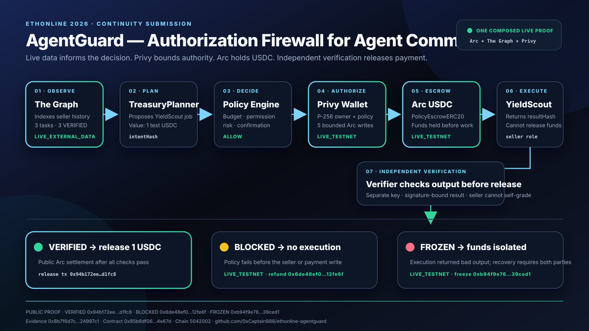

# ETHOnline AgentGuard

> **Policy-gated Agent-to-Agent commerce:** live blockchain data informs an
> autonomous buyer, bounded authority controls the spend, and an independent
> verifier decides whether USDC is released.

## [▶ Open the Public Demo](https://0xcaptain888.github.io/ethonline-agentguard/)

**Judge-ready and no wallet required.** Adjust the policy and seller result in
the browser, inspect `VERIFIED`, `BLOCKED` and `FROZEN`, then open the linked
Arc Testnet transactions and machine-verifiable evidence.

[Public Demo](https://0xcaptain888.github.io/ethonline-agentguard/) ·
[Fixed v1.0.0 Release](https://github.com/0xCaptain888/ethonline-agentguard/releases/tag/ethonline-v1.0.0) ·
[Evidence Manifest](evidence/ethonline-manifest.json) ·
[Five-minute Judge Path](docs/ethonline-submission-kit.md)

For a real testnet walkthrough, use the optional [live browser task path](docs/live-browser-task.md).
It connects an EIP-1193 wallet, checks readiness and asks for a separate wallet
confirmation for every Arc/USDC write.

This is the dedicated **ETHOnline 2026 Continuity** submission repository for
AgentGuard. The pre-existing Monad implementation is the policy, escrow and
verification foundation. The ETHOnline feature work is being added in dated
commits and will be clearly separated from that foundation before submission.
This is a **Continuity submission** rather than a From Scratch entry.

## Official event constraints

- Submission deadline: **September 13, 2026 at 12:00 pm EDT**.
- A **2–4 minute demo video is required**; upload at least 720p and use a human
  voice rather than text-to-speech or an AI voiceover.
- You may select **up to three partner prizes**. If a partner has multiple
  tracks, that partner still counts as one selection.
- This repository is a **Continuity** submission. The pre-existing foundation
  and the ETHOnline additions are documented separately; partner eligibility
  is checked against each partner's own qualification rules.

Source: [ETHGlobal ETHOnline 2026 submission rules](https://ethglobal.com/events/ethonline2026/info/details).

## The one workflow

```text
TreasuryPlanner
  → The Graph live observation
  → policy decision (budget · permission · risk · confirmation)
  → Privy treasury wallet / signer control
  → Arc USDC escrow
  → Seller Agent execution
  → independent verifier
  → VERIFIED / BLOCKED / FROZEN
  → receipt + evidence hash
```

The planner proposes. It does not authorize its own spending and it does not
grade its own work. A policy drift is cancelled and refunded before seller
execution. A bad post-execution result is isolated as `FROZEN`; funds are not
released by default. Every decision is bound to hashes that a judge can
recompute, and all three outcomes now have public Arc Testnet receipts.



The deterministic orchestration path is implemented in
[`src/ethonline/workflow.ts`](src/ethonline/workflow.ts). It is the narrow
join between the Graph observation, policy decision, Privy authorization
boundary, seller result, independent verifier and receipt. The browser replay
has no side effects and is safe for judging. The repository also contains a
real Arc Testnet runner whose Graph observation and policy decision are bound
into the on-chain task intent before USDC settlement.

## ETHOnline sponsor fit

| Partner | Load-bearing role | Status |
| --- | --- | --- |
| Arc / Circle | USDC escrow and conditional Agent-to-Agent settlement | `LIVE_TESTNET` · Privy-authorized 1 USDC task settled as VERIFIED |
| The Graph | Live indexed data drives YieldScout's decision and receipt | `LIVE_EXTERNAL_DATA` · seller history is bound into the live task intent |
| Privy | Policy-controlled buyer wallet and transaction authorization | `LIVE_TESTNET` · nine bounded Arc writes across all three outcomes |

The submission will name only partners that are actually used in the final
demo. Sponsor SDKs, accounts and network writes are never simulated as live
evidence.

## Continuity boundary

### Pre-existing foundation

- Monad AgentGuard contracts and native-MON escrow.
- Policy engine, independent verifier, receipt format and failure states.
- Monad Testnet evidence, benchmarks and judge console.

### New ETHOnline work

- Arc USDC settlement adapter and testnet evidence.
- The Graph live-query adapter connected to YieldScout decisions.
- Privy organization-wallet / signer / policy flow.
- ETHOnline-specific browser demo, sponsor feedback and submission artifacts.

See [the build plan](docs/ethonline-plan.md), [partner fit](docs/partner-fit.md)
and [Arc boundary](docs/arc-integration.md) for the detailed before/after
scope. No pre-existing Monad transaction is presented as Arc evidence.

## Current implementation status

| Surface | Current state | Evidence label |
| --- | --- | --- |
| Policy engine and independent verification | Working and tested on the Monad foundation | `LIVE_TESTNET` (Monad foundation) |
| VERIFIED / BLOCKED / FROZEN state model | Three public Arc tasks with distinct settlement behavior | `LIVE_TESTNET` |
| ETHOnline workflow orchestrator | Deterministic end-to-end join with four regression cases | `SIMULATION` |
| The Graph adapter | Live Studio query with deterministic provenance hash | `LIVE_EXTERNAL_DATA` |
| Arc task-index Subgraph | Version `v0.1.0`, 11 event handlers; the decision snapshot used 3 indexed tasks / 3 VERIFIED with no indexing errors | `LIVE_EXTERNAL_DATA` |
| Arc escrow deployment | Contract `0x85b6…E67d` deployed at block `60909613` | `LIVE_TESTNET` |
| Arc USDC task settlement | Graph-informed approve/create/submit/verify/release complete | `LIVE_TESTNET` |
| Privy wallet control | One policy-bound wallet signed nine constrained writes across VERIFIED, BLOCKED and FROZEN | `LIVE_TESTNET` |
| ETHOnline browser demo | Live Arc, The Graph and Privy evidence plus an explicitly labelled interactive replay | `LIVE_TESTNET` + `LIVE_EXTERNAL_DATA` + `SIMULATION` |

The machine-readable source of truth for these labels is
[`evidence/ethonline-manifest.json`](evidence/ethonline-manifest.json). Run
`npm run ethonline:manifest:verify` before publishing a claim; the check fails
if a `DESIGN` sponsor entry contains a contract, transaction or evidence hash.
The [Privy-authorized Arc task receipt](evidence/arc-testnet-privy-authorized-task.json)
is the strongest proof: a live Subgraph observation scored the seller, the
policy allowed a bounded 1 USDC task, Privy authorized the buyer's writes, and
an independent verifier released the escrow. The earlier
[Graph-driven task](evidence/arc-testnet-graph-driven-task.json) and
[bootstrap task](evidence/arc-testnet-bootstrap-task.json) seeded the seller
history consumed by that decision.

### Primary live proof

- Arc contract: [`PolicyEscrowERC20 · verified source`](https://testnet.arcscan.app/address/0x85b6df0684529fFAB07C6B62eDB6F04a3eC4E67d?tab=contract) · `0x85b6…E67d`
- Verified build: Solidity `v0.8.26+commit.8a97fa7a`, optimizer enabled (`200` runs), EVM `paris`, MIT. The exact Standard JSON input is committed at [`verification/arc-policy-escrow-standard-input.json`](verification/arc-policy-escrow-standard-input.json).
- Privy buyer: [`0x8b9c…d554`](https://testnet.arcscan.app/address/0x8b9cD36D829fC658feD8938a057c27CE072bd554)
- Privy-authorized task ID: `49729611910078900427755243435870633554743331717822925122290378791830782395952`
- Create: [`0x7ec5…06f6`](https://testnet.arcscan.app/tx/0x7ec5e29f0ad2cfc210a72fd4e5220c580b2e6407eb21080ee0947990b9cd06f6)
- Submit: [`0x1b99…1fe4`](https://testnet.arcscan.app/tx/0x1b9954b64963e9f153884556b87845e90e2021ebfa2f6c31bf656ad3851c1fe4)
- VERIFIED release: [`0x94b1…1fc8`](https://testnet.arcscan.app/tx/0x94b172ee29faadbf4a48d0d752685358fff082df9d65bf3753ac779a146d1fc8)
- Task evidence hash: `0x8e285743668e16c24a5de71b9408261d549a20bf81e675fc089ac4e6def787d7`
- Privy authorization hash: `0x80d0f8ec6e8beb2f48a002c94cfc260d200df1a7cc2075daa1d4c8b831a0e0e8`
- Task-bound Graph hash: `0xf3b6f231a396733f4f0605a02f946752bcf2628d05e9bab0480337e320653d42`
- Subgraph: [AgentGuard Arc task index v0.1.0](https://thegraph.com/studio/subgraph/0-x-captain-888)

### Live failure-path proof

- BLOCKED task: `751032723604018145612354418748000548564483670623065072808240271240878241076`
- BLOCKED refund: [`0x6de4…fe6f`](https://testnet.arcscan.app/tx/0x6de48ef03a65fd0ca8c993d1179a235cbe23392d7a7a872b43f3eff92712fe6f)
- FROZEN task: `91763422670729873291418490499372376227515530885224479520711552400109184723901`
- Seller bad-output submission: [`0x8ba2…bed2`](https://testnet.arcscan.app/tx/0x8ba252d6afc88900fbb4604e840bc7efd7f4790b2ed6ce444ba471aea8dbbed2)
- FROZEN verifier decision: [`0xb94f…ced1`](https://testnet.arcscan.app/tx/0xb94f9e76a88aedfbd71cf8bac77b04a135674e38468db9ee5474a7d05539ced1)
- Failure evidence hash: `0x8b7f6d7cb245ab2cfc778e5a92298e9f9ae752e8a1d9aede01605b90e24997c1`
- Full receipt: [`evidence/arc-testnet-live-failure-outcomes.json`](evidence/arc-testnet-live-failure-outcomes.json)

## Why this repository is the ETHOnline entry point

The account has chain-specific and historical experiments, but this is the only
repository submitted to ETHOnline. The relationship is documented in the
[repository map](docs/repo-map.md). The scoring-oriented review path is in the
[judge scoring map](docs/scoring-map.md), and the AI-assisted development
disclosure is in [docs/ai-usage.md](docs/ai-usage.md). See the [AI usage
disclosure](docs/ai-usage.md) for the exact human/AI responsibility boundary.

## Reproduce the foundation locally

```bash
npm install
npm run build
npm run typecheck
npm test
npm run demo
npm run judge:check
```

The existing Monad commands and evidence are retained only as the continuity
baseline. They are useful for verifying the authorization and verification
machinery, but they do not satisfy the Arc, The Graph or Privy sponsor
requirements by themselves.

## The Graph read-only adapter

[`src/ethonline/graph-agent.ts`](src/ethonline/graph-agent.ts) accepts a real
GraphQL endpoint, query and variables, then returns the response with its
endpoint, timestamp, query, variables and deterministic `evidenceHash`.

It never signs, broadcasts or stores a private key. The endpoint must be
provided locally through `GRAPH_SUBGRAPH_URL` or an equivalent runtime config.
A Studio slug or deploy key alone is not a runtime data source; the live claim
is promoted only after a real Query URL returns provenance-bearing data.

The custom [`subgraph/`](subgraph/) indexes the Arc escrow lifecycle itself:
agent registration, policy and verifier bindings, task creation, submission,
verification, blocking, freezing and recovery. Its YieldScout query uses
seller outcome history and aggregate release/refund data as a decision input.
The checked-in Subgraph manifest points to the live Arc Testnet deployment at
block `60909613`. Studio version `v0.1.0` is deployed at IPFS deployment
`QmWk5NVbZsQcZnaZsQhczJXm6HcoZNpGvzGKGdyRhJL8Sy`. It has indexed all three
real tasks as `VERIFIED`, including the Privy-created task, with no indexing
errors.

## Privy policy-controlled Arc authorization

The live flow creates a dedicated Privy wallet with a P-256 owner and attaches
a policy restricted to Arc chain `5042002`, zero native value and only two
targets: the AgentGuard escrow and Arc USDC contracts. That wallet signed five
public writes: agent registration, spend policy, verifier binding, USDC
approval and task creation. Seller submission and verifier settlement remain
separate roles.

The complete sanitized receipt is
[`evidence/arc-testnet-privy-authorized-task.json`](evidence/arc-testnet-privy-authorized-task.json).
Local authorization material and the App Secret remain ignored files. The
reproducible setup and task runners are `npm run ethonline:privy:setup` and
`npm run ethonline:privy:arc-task`; they require local credentials and testnet
funds and are not part of the credential-free judge command.

Any reviewer can independently re-hash the receipt and query Arc for every
Privy-authorized sender, target, value and transaction status with:

```bash
npm run ethonline:privy:evidence:verify
```

## Security boundary

- No private keys, seed phrases, API keys or OAuth tokens are committed.
- Browser wallet writes are opt-in and must verify the expected chain ID.
- A read-only data source cannot release escrow.
- A seller cannot act as its own verifier.
- Receipts must be re-hashed before they are eligible for settlement.
- Real sponsor evidence is labelled separately from local replay evidence.

Read [SECURITY.md](SECURITY.md) and [dependency security notes](docs/dependency-security.md).

## Demo and submission artifacts

The ETHOnline demo is a separate browser surface with:

1. One live Arc Testnet `VERIFIED` task driven by real Graph data.
2. One live Arc Testnet `BLOCKED` cancellation and refund before seller work.
3. One live Arc Testnet `FROZEN` bad-output path with funds held.
4. Arc transaction and receipt evidence visible to the judge.
5. A Graph provenance panel and the real Privy wallet authorization proof.

The final submission will include a 2–4 minute video, public source, sponsor
feedback documents, an architecture diagram and a machine-readable evidence
manifest. Arc, The Graph and Privy meet the repository's live-evidence rule,
and VERIFIED, BLOCKED and FROZEN all have public transaction receipts. The
browser controls remain a safe deterministic replay of those state boundaries.

## Five-minute judge path

```bash
git clone https://github.com/0xCaptain888/ethonline-agentguard.git
cd ethonline-agentguard
npm ci
npm run ethonline:check
```

Then open the [public demo](https://0xcaptain888.github.io/ethonline-agentguard/)
and use the policy playground. The page labels every sponsor surface as
`DESIGN`, `SIMULATION`, or live evidence until a public proof is attached.
The [ETHOnline evidence manifest](evidence/ethonline-manifest.json) is the
judge's single index for chain, provider and receipt proof.

The orchestrator regression suite is in
[`test/ethonline-workflow.test.ts`](test/ethonline-workflow.test.ts). It proves
that policy failures short-circuit before verification, failed authorization
cannot produce a result hash, and a bad seller result becomes `FROZEN` rather
than eligible for release.

Receipt integrity can be checked independently with
`npm run ethonline:receipt:verify`. The Arc failure receipts and live contract
states can be checked with `npm run ethonline:failure:evidence:verify`. Neither
command broadcasts a transaction or needs sponsor signing credentials.

For the final form, use the [submission checklist](docs/ethonline-submission-checklist.md)
and run `npm run ethonline:submission:check` first.

## Links

- [ETHOnline build plan](docs/ethonline-plan.md)
- [Partner fit matrix](docs/partner-fit.md)
- [Arc integration boundary](docs/arc-integration.md)
- [Contract security notes and verified build](docs/contract-security-notes.md)
- [Live-evidence runbook](docs/ethonline-live-runbook.md)
- [Contract security notes](docs/contract-security-notes.md)
- [The Graph adapter](src/ethonline/graph-agent.ts)
- [Architecture](docs/architecture.md)
- [ETHOnline architecture](docs/ethonline-architecture.md)
- [One-page submission architecture](docs/assets/ethonline-agentguard-architecture.svg)
- [Final ETHGlobal form copy](docs/ethonline-form-copy.md)
- [Live browser task path](docs/live-browser-task.md)
- [Judge guide](docs/judge-guide.md)
- [Existing Monad foundation](https://github.com/0xCaptain888/monad-agentguard)

## License

MIT
